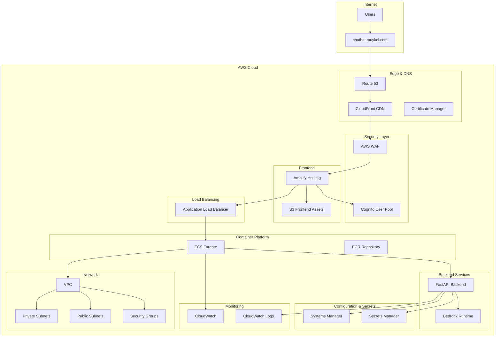

# Design Document

## Overview

This design document outlines the migration of the faith-based motivator chatbot from a localhost Streamlit application to a scalable, production-ready AWS cloud deployment. The solution replaces Streamlit with AWS Amplify for the frontend, containerizes the backend API, implements proper authentication with Cognito, and uses AWS CDK with Python for Infrastructure as Code.

## Architecture

### High-Level Architecture



### Technology Stack Migration

**Current (Streamlit):**

- Frontend: Streamlit web interface
- Backend: Python with boto3
- Hosting: Local development server
- Authentication: None

**Target (AWS Cloud):**

- Frontend: Reflex (Python) hosted on AWS Amplify
- Backend: FastAPI containerized on ECS Fargate
- Authentication: AWS Cognito User Pools
- Infrastructure: AWS CDK with Python
- Domain: chatbot.muykol.com with Route 53

## Components and Interfaces

### 1. Frontend Application (Reflex on AWS Amplify)

**Technology:** Reflex (Pure Python) with AWS SDK integration
**Hosting:** AWS Amplify with built-in CDN (Reflex compiles to Next.js)
**Domain:** chatbot.muykol.com

**Key Features:**

- Responsive chat interface built with Python components
- Real-time state management with Reflex State
- User authentication integration with Cognito
- Session management and token handling
- Component-based architecture similar to React but in Python

**Reflex Implementation:**

```python
import reflex as rx
from typing import List, Optional

class ChatState(rx.State):
    message: str = ""
    chat_history: List[dict] = []
    is_loading: bool = False
    user_authenticated: bool = False

    async def send_message(self):
        if not self.message.strip():
            return

        self.is_loading = True
        # Add user message to history
        self.chat_history.append({
            "type": "user",
            "content": self.message
        })

        # Call backend API
        response = await self.call_chatbot_api(self.message)

        # Add bot response to history
        self.chat_history.append({
            "type": "bot",
            "emotion": response["emotion"],
            "bible_verse": response["bible_verse"],
            "message": response["message"]
        })

        self.message = ""
        self.is_loading = False
```

**API Integration:**

- HTTP client integration with FastAPI backend
- JWT token management through Reflex state
- Error handling with Python exception patterns
- Loading states managed through Reflex reactive system

### 2. Backend API Service (FastAPI on ECS Fargate)

**Technology:** FastAPI (replacing Streamlit backend logic)
**Container Platform:** ECS Fargate with Application Load Balancer
**Image Repository:** Amazon ECR

**API Endpoints:**

```python
# Core chatbot functionality
POST /api/v1/chat
- Input: {"message": "user input text"}
- Output: {"emotion": "detected_emotion", "bible_verse": "verse", "message": "encouragement"}

# Health check
GET /api/v1/health
- Output: {"status": "healthy", "timestamp": "ISO_timestamp"}

# User feedback
POST /api/v1/feedback
- Input: {"session_id": "uuid", "helpful": boolean, "emotion": "string"}
- Output: {"status": "recorded"}
```

**Core Logic Migration:**

- `get_chatbot_response()` → FastAPI endpoint handler
- `generate_conversation()` → Bedrock service integration
- JSON parsing and emotion detection logic preserved
- Enhanced error handling and logging

### 3. Authentication Service (AWS Cognito)

**User Pool Configuration:**

- Email-based authentication
- Password policy: minimum 8 characters, mixed case, numbers
- Email verification required
- JWT token expiration: 1 hour (configurable)

**User Attributes:**

- Email (required)
- Given name (optional)
- Family name (optional)
- Preferred username (optional)

**Integration Points:**

- Amplify frontend for login/signup UI
- FastAPI backend for token validation
- API Gateway for request authorization

### 4. Container Infrastructure (ECS Fargate)

**Service Configuration:**

- Task Definition: 0.5 vCPU, 1GB memory
- Auto Scaling: 1-10 tasks based on CPU/memory utilization
- Health Checks: HTTP GET /api/v1/health every 30 seconds
- Rolling deployments with 50% replacement strategy

**Docker Configuration:**

```dockerfile
FROM python:3.11-slim
WORKDIR /app
COPY requirements.txt .
RUN pip install --no-cache-dir -r requirements.txt
COPY . .
EXPOSE 8000
CMD ["uvicorn", "main:app", "--host", "0.0.0.0", "--port", "8000"]
```

### 5. Load Balancing (Application Load Balancer)

**Configuration:**

- Target Group: ECS Fargate tasks on port 8000
- Health Check: /api/v1/health endpoint
- Sticky Sessions: Disabled (stateless API)
- SSL Termination: TLS 1.2+ with ACM certificate

**Routing Rules:**

- `/api/*` → Backend ECS service
- All other paths → 404 (frontend handled by Amplify)

### 6. Security Layer

**AWS WAF Rules:**

- AWS Managed Core Rule Set
- AWS Managed Known Bad Inputs Rule Set
- Rate limiting: 2000 requests per 5 minutes per IP
- Geographic restrictions: Configurable by region

**Network Security:**

- VPC with public/private subnet architecture
- ECS tasks in private subnets only
- ALB in public subnets
- Security Groups with minimal required ports:
  - ALB: 80, 443 from internet
  - ECS: 8000 from ALB only
  - Bedrock: HTTPS outbound only

**Data Encryption:**

- TLS 1.2+ for all data in transit
- EBS volumes encrypted with AWS KMS
- Secrets Manager for sensitive configuration
- Systems Manager Parameter Store for non-sensitive config

## Data Models

### 1. Chat Request/Response Model

```python
from pydantic import BaseModel
from typing import List, Optional
from datetime import datetime

class ChatRequest(BaseModel):
    message: str
    session_id: Optional[str] = None
    user_id: Optional[str] = None

class BibleVerse(BaseModel):
    reference: str
    text: str

class ChatResponse(BaseModel):
    emotion: str
    bible_verse: BibleVerse
    message: str
    session_id: str
    timestamp: datetime
    confidence_score: Optional[float] = None

class FeedbackRequest(BaseModel):
    session_id: str
    helpful: bool
    emotion: str
    user_comment: Optional[str] = None
```

### 2. User Authentication Model

```python
class User(BaseModel):
    user_id: str  # Cognito sub
    email: str
    given_name: Optional[str] = None
    family_name: Optional[str] = None
    created_at: datetime
    last_login: Optional[datetime] = None

class AuthToken(BaseModel):
    access_token: str
    id_token: str
    refresh_token: str
    expires_in: int
    token_type: str = "Bearer"
```

### 3. Configuration Model

```python
class AppConfig(BaseModel):
    aws_region: str
    bedrock_model_id: str
    cognito_user_pool_id: str
    cognito_client_id: str
    log_level: str = "INFO"

    class Config:
        env_file = ".env"
```

## Error Handling

### 1. Frontend Error Handling

**Network Errors:**

- Connection timeouts: Retry with exponential backoff
- 5xx errors: Display user-friendly message, log for monitoring
- 4xx errors: Show specific error message to user

**Authentication Errors:**

- Token expiration: Automatic refresh attempt
- Invalid credentials: Redirect to login
- Session timeout: Clear local storage, redirect to login

### 2. Backend Error Handling

**Bedrock API Errors:**

- Rate limiting: Implement exponential backoff
- Model unavailable: Fallback to cached responses
- Invalid input: Return structured error response

**Validation Errors:**

- Input validation: Return 400 with detailed field errors
- Authentication: Return 401 with clear error message
- Authorization: Return 403 with appropriate message

**System Errors:**

- Database connection: Circuit breaker pattern
- External service failures: Graceful degradation
- Memory/CPU limits: Proper resource monitoring

### 3. Monitoring and Alerting

**CloudWatch Metrics:**

- API response times (target: <2 seconds)
- Error rates (target: <1%)
- Container CPU/Memory utilization
- Bedrock API call success rates

**CloudWatch Alarms:**

- High error rate (>5% for 5 minutes)
- High response time (>5 seconds for 3 minutes)
- Container health check failures
- WAF blocked request spikes

## Testing Strategy

### 1. Unit Testing

**Backend API Tests:**

```python
# Test emotion detection logic
def test_emotion_detection():
    response = get_chatbot_response("I'm feeling anxious")
    assert response.emotion in ["anxious", "worried", "fearful"]
    assert response.bible_verse is not None
    assert response.message is not None

# Test API endpoints
def test_chat_endpoint():
    response = client.post("/api/v1/chat",
                          json={"message": "I'm excited!"})
    assert response.status_code == 200
    assert "emotion" in response.json()
```

**Frontend Component Tests (Reflex):**

```python
# Test chat interface components
import pytest
from reflex.testing import AppHarness

def test_chat_interface():
    """Test chat message sending functionality"""
    with AppHarness(ChatApp) as harness:
        # Set initial state
        harness.app_state.chat_state.message = "I'm feeling anxious"

        # Trigger send message
        harness.app_state.chat_state.send_message()

        # Verify message was added to history
        assert len(harness.app_state.chat_state.chat_history) == 2
        assert harness.app_state.chat_state.chat_history[0]["type"] == "user"
        assert harness.app_state.chat_state.chat_history[1]["type"] == "bot"

def test_authentication_flow():
    """Test Cognito authentication integration"""
    with AppHarness(ChatApp) as harness:
        # Test login state management
        harness.app_state.auth_state.login("test@example.com", "password")
        assert harness.app_state.auth_state.user_authenticated == True
```

### 2. Integration Testing

**API Integration Tests:**

- End-to-end chat flow with real Bedrock calls
- Authentication flow with Cognito
- Load balancer health checks
- Database connection and query tests

**Infrastructure Tests:**

- CDK deployment validation
- Security group rule verification
- SSL certificate validation
- DNS resolution testing

### 3. Performance Testing

**Load Testing:**

- Simulate 100 concurrent users
- Test auto-scaling behavior
- Measure response times under load
- Validate rate limiting effectiveness

**Stress Testing:**

- Test system behavior at capacity limits
- Validate graceful degradation
- Test recovery after failures
- Monitor resource utilization patterns

### 4. Security Testing

**Authentication Testing:**

- JWT token validation
- Session management
- Password policy enforcement
- Multi-factor authentication (if enabled)

**API Security Testing:**

- Input validation and sanitization
- SQL injection prevention
- XSS protection
- Rate limiting effectiveness

**Infrastructure Security Testing:**

- Network segmentation validation
- Security group rule verification
- WAF rule effectiveness
- Encryption in transit/at rest validation

## Deployment Strategy

### 1. Environment Strategy

**Development Environment:**

- Single ECS task, minimal resources
- Shared Cognito user pool for testing
- CloudWatch logs with DEBUG level
- Cost-optimized instance types

**Staging Environment:**

- Production-like configuration
- Separate Cognito user pool
- Full monitoring and alerting
- Performance testing capabilities

**Production Environment:**

- Multi-AZ deployment
- Auto-scaling enabled
- Full security controls
- Comprehensive monitoring

### 2. CI/CD Pipeline (GitHub Actions with OIDC)

**Source Control:**

- GitHub repository with feature branches
- Pull request reviews required
- Automated testing on commits
- Branch protection rules for main/production

**OIDC Configuration:**

```python
# CDK OIDC Provider setup
class GitHubOIDCStack(Stack):
    def __init__(self, scope: Construct, construct_id: str, **kwargs):
        super().__init__(scope, construct_id, **kwargs)

        # GitHub OIDC Provider
        github_provider = iam.OpenIdConnectProvider(
            self, "GitHubOIDC",
            url="https://token.actions.githubusercontent.com",
            client_ids=["sts.amazonaws.com"],
            thumbprints=["6938fd4d98bab03faadb97b34396831e3780aea1"]
        )

        # IAM Role for GitHub Actions
        github_role = iam.Role(
            self, "GitHubActionsRole",
            assumed_by=iam.WebIdentityPrincipal(
                github_provider.open_id_connect_provider_arn,
                conditions={
                    "StringEquals": {
                        "token.actions.githubusercontent.com:aud": "sts.amazonaws.com"
                    },
                    "StringLike": {
                        "token.actions.githubusercontent.com:sub": "repo:your-username/chatbot-repo:*"
                    }
                }
            ),
            managed_policies=[
                iam.ManagedPolicy.from_aws_managed_policy_name("PowerUserAccess")
            ]
        )
```

**GitHub Actions Workflow:**

```yaml
# .github/workflows/deploy.yml
name: Deploy Chatbot

on:
  push:
    branches: [main, develop]
  pull_request:
    branches: [main]

permissions:
  id-token: write
  contents: read

jobs:
  test:
    runs-on: ubuntu-latest
    steps:
      - uses: actions/checkout@v4
      - name: Set up Python
        uses: actions/setup-python@v4
        with:
          python-version: "3.11"
      - name: Install dependencies
        run: |
          pip install -r requirements.txt
          pip install pytest
      - name: Run tests
        run: pytest tests/

  build-and-deploy:
    needs: test
    runs-on: ubuntu-latest
    if: github.ref == 'refs/heads/main'

    steps:
      - uses: actions/checkout@v4

      - name: Configure AWS credentials
        uses: aws-actions/configure-aws-credentials@v4
        with:
          role-to-assume: ${{ secrets.AWS_ROLE_ARN }}
          aws-region: us-east-1

      - name: Set up Python
        uses: actions/setup-python@v4
        with:
          python-version: "3.11"

      - name: Install CDK
        run: |
          npm install -g aws-cdk
          pip install aws-cdk-lib constructs

      - name: Build Docker image
        run: |
          docker build -t chatbot-api .

      - name: Login to ECR
        run: |
          aws ecr get-login-password --region us-east-1 | docker login --username AWS --password-stdin ${{ secrets.ECR_REGISTRY }}

      - name: Push to ECR
        run: |
          docker tag chatbot-api:latest ${{ secrets.ECR_REGISTRY }}/chatbot-api:latest
          docker push ${{ secrets.ECR_REGISTRY }}/chatbot-api:latest

      - name: Deploy with CDK
        run: |
          cd infrastructure
          cdk deploy --require-approval never
```

**Deployment Process:**

1. **Automated Testing** - Unit and integration tests on every PR
2. **Security Scanning** - Container vulnerability scanning with Trivy
3. **CDK Diff Review** - Automated diff comments on PRs
4. **Environment Promotion** - Dev → Staging → Production with approvals
5. **Rollback Strategy** - Automated rollback on health check failures
6. **Post-deployment Verification** - Automated smoke tests

### 3. Infrastructure as Code (AWS CDK Python)

**CDK Stack Structure:**

```python
# Main application stack
class ChatbotStack(Stack):
    def __init__(self, scope: Construct, construct_id: str, **kwargs):
        super().__init__(scope, construct_id, **kwargs)

        # VPC and networking
        self.vpc = self.create_vpc()

        # Security components
        self.waf = self.create_waf()
        self.cognito = self.create_cognito()

        # Container infrastructure
        self.ecs_cluster = self.create_ecs_cluster()
        self.load_balancer = self.create_load_balancer()

        # Frontend hosting
        self.amplify_app = self.create_amplify_app()

        # Domain and SSL
        self.domain_setup = self.create_domain_setup()
```

**Environment Configuration:**

```python
# Environment-specific configurations
environments = {
    "dev": {
        "instance_count": 1,
        "instance_size": "small",
        "auto_scaling": False
    },
    "staging": {
        "instance_count": 2,
        "instance_size": "medium",
        "auto_scaling": True
    },
    "prod": {
        "instance_count": 3,
        "instance_size": "large",
        "auto_scaling": True
    }
}
```

This design provides a comprehensive, scalable, and secure architecture for migrating your faith-based motivator chatbot to AWS cloud while maintaining all existing functionality and adding enterprise-grade features.
